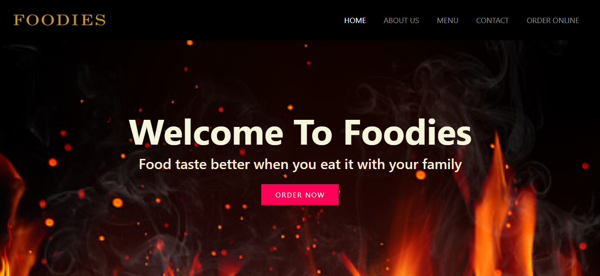
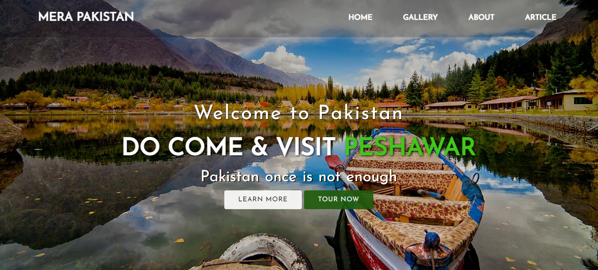
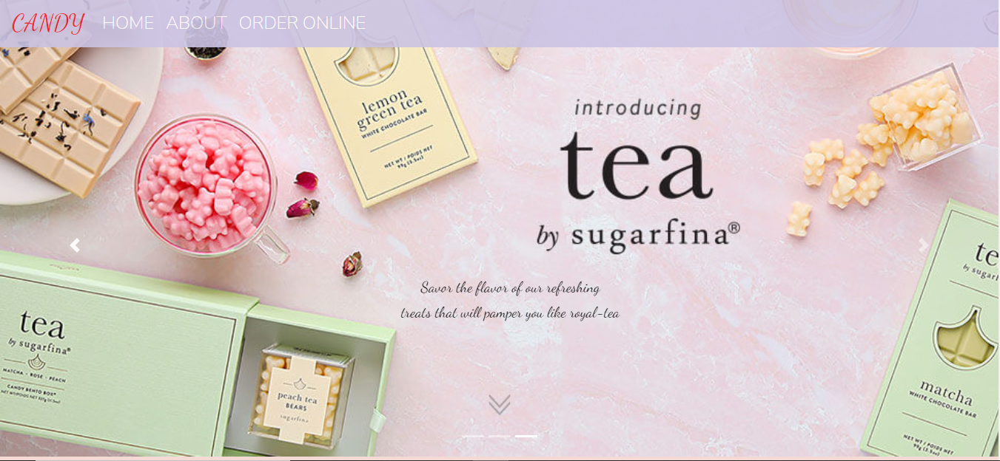
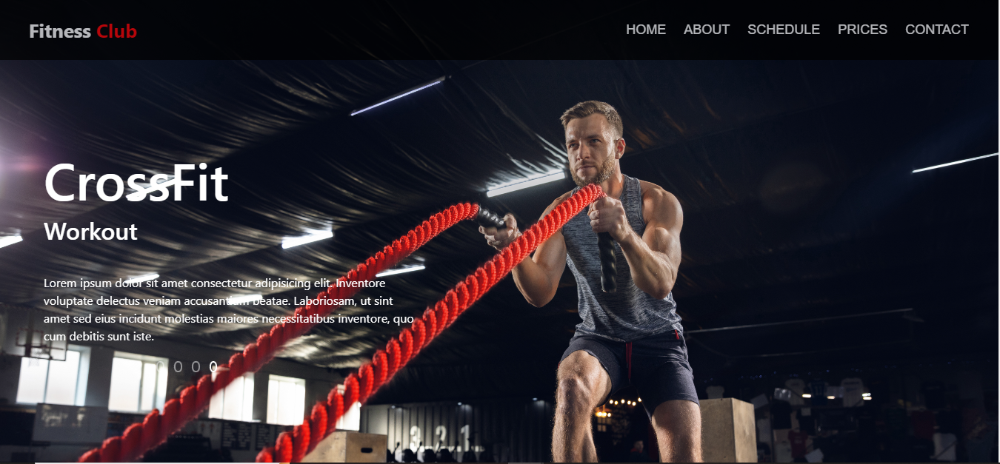
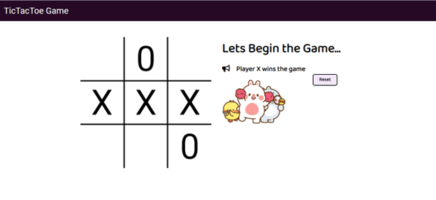

<h1 align="center" >Hello, I'm <a href="https://www.linkedin.com/in/muhammad-samiullah-2002/" target="_blank"> Muhammad Samiullah </a> </h1>

 
### About Me,

 I am <b>Muhammad Samiullah</b> pursuing my <b>Computer Science Degree</b> from DHA Suffa University, Currently in my 3rd year of Bachelor's. As of now, I am focused on <b>Web and Cloud technologies </b>. ⚡
 
 <h3 align="center"> Explorer | Web Developer | Open Source Contributor</h3>
 
 

 <h1>Let's Learn, Grow and Connect</h1>

<a href="mailto:samipak458@gmail.com">
<a  href="https://github.com/samipak458?wt.mc_id=studentamb_202028">

 
 

<h1>🛠 About My Tech Stack</h1>

   
I'm a front-end developer who is passionate about making open source more accessible, creating technology to elevate
people, and building community. Some technology I enjoyed working with include Html/CSS, React.js, Node.js, 
Express.js and MongoDB. Recently, I earned an **"Open Sourcer"** badge from **Microsoft** for outstanding contributions to Microsoft Repositories.

I participated in the first-ever **Student Ambassador Bug Bash**. I improved the readability and usability of the **Microsoft Learn** Docs and Modules that contain GitHub, C#, and Azure Static Web Apps content and service overall!

I found **five bugs** in Microsoft Learn Azure Static Web Apps Documentation and **one bug** each in the Microsoft Learn GitHub and C# module. I make Learn modules better by clearing the confusing part of docs which bridges the gap in existing Microsoft Learn doc and I also spot the error which is not defined in docs. By identifying these bugs, I make the user experience better. 

> ### “It’s the possibility of having dream come true that makes life so interesting.”

 

### I love to collaborate on any project especially open source projects.
  
   

 

 

 
 
 
 
 
 
 
 
 
 
 
 

I believe in implementing the knowledge which you have. Projects play a major role in showcasing your skills. They help in predicting skills of a person. So let's have a look at my project section.

<h1>Projects 💻</h1>
<!-- <h1 align="center">Projects</h1> -->
<table bordercolor="#66b2b2">
  
  <tr>
    <td width="50%" valign="top">
      <h3 align="center">Foodies</h3>
         
        
         
        

           
    
  
      

        
<strong>Html, CSS, BootStrap & Javascript</strong> - Foodies :  A restaurant website. You can place orders and keep track of it.

    </td>
    <td width="50%" valign="top">
      <h3 align="center">Mera Pakistan</h3>
         
      
         
        

    
  
      

        
<strong>Html, CSS & Javascript</strong> - Mera Pakistan : A tourist guide to Pakistan.

    </td>
  </tr>
  
  <tr>
    <td width="50%" valign="top">
      <h3 align="center">Candy Store</h3>
       
        
       
        

           
  
  
      

        
<strong>HTML5, CSS3, & Javascript</strong> - Candy Store : I created a responsive website called “Candy” where you can see various products (Chocolates and different types of candies). You can place an order.

    </td>
<td width="50%" valign="top">
      <h3 align="center">Fitness Club</h3>
         
        
         
        

           
  
  
      

        
<strong>HTML5, CSS3 & Javascript</strong> - Fitness Club : This is user-friendly website where you can see details about gym, trainers, facility, class schedule and monthly packages.

    </td>
  </tr>

   <tr>
    <td width="50%" valign="top">
      <h3 align="center">Portfolio</h3>
       
        
       
        

           
  
      

        
<strong>HTML5, CSS3, Bootstrap & Javascript</strong> - Portfolio Site including links to my projects and ways to get in contact with me.

    </td>
   <td width="50%" valign="top">
      <h3 align="center">Tic Tac Toe</h3>
       
        
       
        

           
  
      

        
<strong>HTML5, CSS3, & Javascript</strong> - Tic-tac-toe is a classic two-player game that, if both players play their best, will always finish in a tie. The game is also known as Xs and Os or noughts and crosses.

    </td>
  </tr>   
</table>

  
# ⚙️ GitHub Analytics
  
  <table>
  <tr>
   
<td>
    <td></td>
  </tr>
</table>

  

# 📈 Contribution Graph  
 

 

 

 # 🚀 Contributions Featured on Microsoft

https://user-images.githubusercontent.com/52650290/194592069-a598d836-7e29-401b-913d-51746da3f817.mp4
 
<h2 align="left">Support My Work:</h2>

  

<!---
samipak458/samipak458 is a ✨ special ✨ repository because its `README.md` (this file) appears on your GitHub profile.
You can click the Preview link to take a look at your changes.
--->
