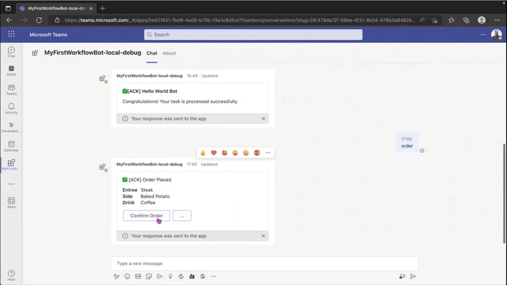
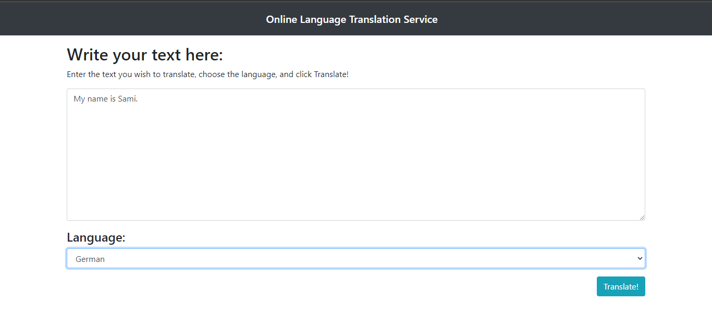

<h1 align="center" >Hello, I'm <a href="https://www.linkedin.com/in/muhammad-samiullah-2002/" target="_blank"> Muhammad Samiullah </a> </h1>

 
### About Me,

 I am <b>Muhammad Samiullah</b> pursuing my <b>Computer Science Degree</b> from DHA Suffa University, Currently in my final year of Bachelor's. As of now, I am focused on <b>Cloud engineering</b>. ⚡
 
 <h3 align="center"> Explorer | Cloud Engineer | Open Source Developer</h3>
 
 

 <h1>Let's Learn, Grow and Connect</h1>

<a href="mailto:samipak458@gmail.com">
<a  href="https://github.com/samipak458?wt.mc_id=studentamb_202028">

 
 

<h1>🛠 About My Tech Stack</h1>

   
I'm a **Web** and 𝐎𝐩𝐞𝐧 𝐒𝐨𝐮𝐫𝐜𝐞 𝐃𝐞𝐯𝐞𝐥𝐨𝐩𝐞𝐫. With a passion for developing websites that solve real-world problems, I have a proven track record of delivering innovative solutions and specialize in identifying and resolving bugs within technical documentation. 

I'm passionate about making open source more accessible, creating technology to elevate people, and building community. Some technology I enjoyed working with include Html/CSS, React.js, Node.js, Express.js, MongoDB and Azure. 

With over 1 year of experience as a **Web** 𝐃𝐞𝐯𝐞𝐥𝐨𝐩𝐞𝐫, I have contributed to the open-source community as an **Open Source Developer** at 𝐌𝐢𝐜𝐫𝐨𝐬𝐨𝐟𝐭. My expertise includes developing and enhancing Azure Static Web Apps projects and identifying and resolving bugs in **Microsoft Learn Modules**. I have earned the prestigious **Azure Hero Open Source** Badge, reflecting my commitment and achievements in the open-source community.

I contributed in the **Student Ambassador Bug Bash** where I found **five bugs** in Microsoft Learn Azure Static Web Apps Documentation and **one bug** each in the Microsoft Learn C#, GitHub and Azure Cognitive module. I make Learn modules better by clearing the confusing part of docs which bridges the gap in existing Microsoft Learn doc and I also spot the error which is not defined in docs. By identifying these bugs, I make the user experience better. 

In addition, as a **Web Dev Summer Intern at Folio3**, I gained knowledge and experience in implementing the Software Development Life Cycle (SDLC) and developed a platform using HTML, CSS and JavaScript that addressed the challenges faced by women, transgender, and disabled individuals in accessing food resources while ensuring their anonymity and security, resulting in increased access to aid from organizations and donors. I received the 3rd Runner Up Award for Best Project Implementation and Delivery upon completion of the 9-week Summer Internship Program at Folio3 Software.

> ### “It’s the possibility of having dream come true that makes life so interesting.”

# Languages & Tools

 

 

 
 
 
 
 
 
 
 
 
 
 
 

<h1>Projects 💻</h1>
I believe in implementing the knowledge which you have. Projects play a major role in showcasing your skills. They help in predicting skills of a person. So let's have a look at my project section.
  
<!-- <h1 align="center">Projects</h1> -->
<table bordercolor="#66b2b2">

<tr>
  <td width="50%" valign="top">
      <h3 align="center">ChatGPT MS Teams Bot</h3>
         
        
         
        

           
   
      

        
<strong>MS Teams, AI & Javascript</strong> - ChatGPT MS Teams Bot : Bot serves as a versatile tool to assist users in various aspects, including chat interactions, meetings, and work-related tasks.

    </td>
    <td width="50%" valign="top">
      <h3 align="center">Online AI Text Translator</h3>
         
      
         
        

    
  
         
      

        
<strong>Html, CSS, Flask & Azure Congnitive Service</strong> - AI Text Translator : Web application that can translate text in real-time and with high accuracy. The user can input text in one language, and the application will automatically detect the language and translate the text into the user's desired language.

    </td>
  </tr>
  
  <tr>
    <td width="50%" valign="top">
      <h3 align="center">Foodies</h3>
         
        
         
        

           
    
  
      

        
<strong>Html, CSS, BootStrap & Javascript</strong> - Foodies :  A restaurant website. You can place orders and keep track of it.

    </td>
    <td width="50%" valign="top">
      <h3 align="center">Mera Pakistan</h3>
         
      
         
        

    
  
      

        
<strong>Html, CSS & Javascript</strong> - Mera Pakistan : A tourist guide to Pakistan.

    </td>
  </tr>
  
  <tr>
    <td width="50%" valign="top">
      <h3 align="center">Candy Store</h3>
       
        
       
        

           
  
  
      

        
<strong>HTML5, CSS3, & Javascript</strong> - Candy Store : I created a responsive website called “Candy” where you can see various products (Chocolates and different types of candies). You can place an order.

    </td>
<td width="50%" valign="top">
      <h3 align="center">Fitness Club</h3>
         
        
         
        

           
  
  
      

        
<strong>HTML5, CSS3 & Javascript</strong> - Fitness Club : This is user-friendly website where you can see details about gym, trainers, facility, class schedule and monthly packages.

    </td>
  </tr>

   <tr>
    <td width="50%" valign="top">
      <h3 align="center">Portfolio</h3>
       
        
       
        

           
  
      

        
<strong>HTML5, CSS3, Bootstrap & Javascript</strong> - Portfolio Site including links to my projects and ways to get in contact with me.

    </td>
   <td width="50%" valign="top">
      <h3 align="center">Tic Tac Toe</h3>
       
        
       
        

           
  
      

        
<strong>HTML5, CSS3, & Javascript</strong> - Tic-tac-toe is a classic two-player game that, if both players play their best, will always finish in a tie. The game is also known as Xs and Os or noughts and crosses.

    </td>
  </tr>   
</table>

### I love to collaborate on any project especially open source projects. 
  
# ⚙️ GitHub Analytics
  
  <table>
  <tr>
<td></td>   
    <td></td>
  </tr>
   <tr>
<td></td>
<td></td>
 </tr>
</table>

# 📈 Contribution Graph  

 

 

 # 🚀 Contributions Featured on Microsoft

https://user-images.githubusercontent.com/52650290/194592069-a598d836-7e29-401b-913d-51746da3f817.mp4
 

# 🏆 HacktoberFest and MLH 2022 & 2023 Badges
 

 
<h2 align="left">Support My Work:</h2>

  

<!---
samipak458/samipak458 is a ✨ special ✨ repository because its `README.md` (this file) appears on your GitHub profile.
You can click the Preview link to take a look at your changes.
--->
